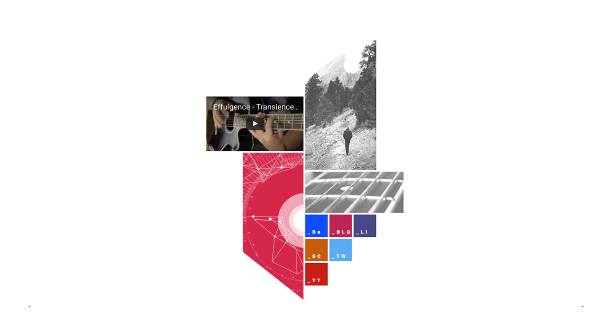
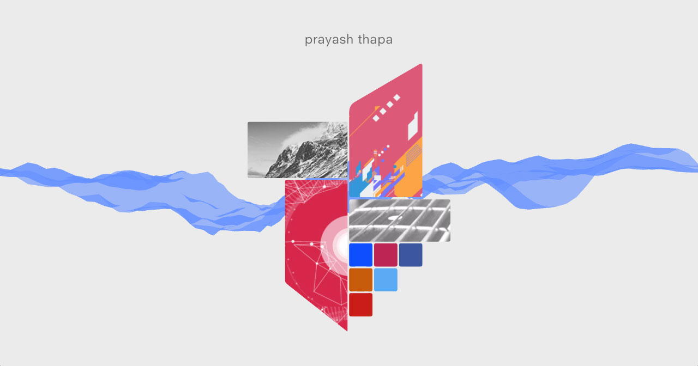
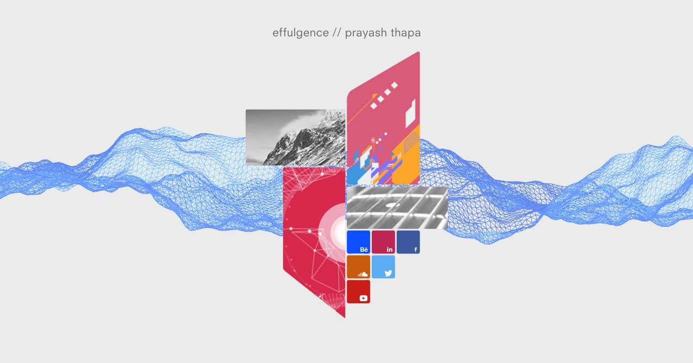

tl;dr What started out as a school project eventually turned into effulgence.io.

When I started this project, I started to think about what it would mean for my website to be different. I knew I wanted to stray away from the generic patterns that are employed on so many webpages out there. But I didn't want to stray too far from these familiar patterns that it felt foreign to the average visitor. I wanted the interface of my site to have a fresh look to bring something different to the table, but still have a sense of intuitiveness to it so that people could curiously click through without hesitation.

After a few hours of brainstorming and trying out various designs, I came up with this:

Super basic sketch of the homepage layout.

It resembles an abstract P (to me at least, most people didn't see it at first glance), and is emblematic in nature. I love the simple geometry behind it. I felt very strongly about having visual elements much more than textual ones, so I decided to embed pictures into the 4 blocks and use those as my main navigation links. Something about your eyes interpreting colors and visual stimuli in a parallel manner vs interpreting text in a serial manner. Yeah...  that's cool. Let's formalize that on a webpage:

Check it out live [here.](http://effulgence.io/v1)

Now, this was in no way perfect. The styling would crap itself on mobile. Gave it a nice harsh white background (cringe). I hardcoded all the markup and CSS. None of the images were optimized. It was a bunch of ```<div>``` elements floating next to each other in the middle of nowhere which brought about some interesting layout challenges in CSS. The site loaded extremely slow because of all the external assets I was pulling. I also had the wonderfully brilliant idea of embedding a bunch of soundcloud players and rendering them in an ```<iframe>``` when you clicked on a specific link. All of this made sense for me at the time but it also resulted in a very choppy experience. Frankly, it was not even a fully realized website. It was a static landing page that just happened to have a bunch of links to other places.

Fast forward a year or so and we arrive at v2:

Check it out live [here.](http://effulgence.io/v2)

Still not a full site. It's a single page with a bunch of jQuery spaghetti handling clicks and hiding/showing things on cue. Regardless, I got more experience making other sites (and apps). v2 harnesses the power of inline SVGs, meaning my whole graphic is embedded into my page as a bunch of numbers that the browser knows how to draw. Working with SVG allowed me to be meticulous about the design. It gave me full control of the sizing, curvature of lines, relative placement of the blocks, all with added benefit of not having to write any custom CSS to achieve the same layout. And if I wanted to change something I could simply pop back into Illustrator, make my changes, and copy-paste the new numbers into my HTML. I embedded my navigation links wrapping the ```<path>``` tags of the SVG. And search engines would still crawl through it, because in the end, it's all just markup. Brilliant, thank you W3C.

You might have also noticed that v2 has an animation running in the back. Shortly after v1 and v2, I started spending more time exploring the realm of [creative coding](https://en.wikipedia.org/wiki/Creative_coding). I started a project where I coded a graphic everyday for the year (I failed halfway through but that's another story). But the 100+ pieces that I did do taught me a lot. It became clear to me that I needed to incorporate this into my website. And off I went trying to integrate a ```<canvas>``` element into my site because animations are cool. They add so much to the visual experience. I was an art-major.. of course I was going to add this to my site. Who am I kidding?

v2 gave me a much clearer direction as to where I wanted my site to go. I was happy that I had something unique, and it had a cool animation with some content, but the experience wasn't satisfying enough to me. I hated using some hacky jQuery just to get the single page application feeling, and I didn't want to remake the whole thing using some hot new JavaScript framework that come out this morning to accomplish that. And I certainly didn't want my whole page to be rendered dynamically on load, even though Google does index pages that use JavaScript to render their UI. I also wanted to start a blog, so I could post more content. Also the page had no sense of history, meaning that you were stuck on one page and could not navigate using the back and forward buttons. Not a good user experience. There had to be another way.

I considered using Jekyll (a static site/blog generator), but I REALLY wanted the single page design to work. I did not want the page to refresh every time the user navigated to another page on the site. I wanted it to be a unified, cohesive experience from one part of the site to another, no jitters and no refreshes. The Web has come so far, why not utilize it to its fullest?

After a lot of research, I ran into an awesome new framework called [gatsby.js](https://github.com/gatsbyjs/gatsby), a static site generator that transforms plain text into dynamic blogs and websites using React (an amazing library that lets you create functional UIs). It has no page reloads, supports global page transitions, and leverages server-side rendering so all the components are rendered into raw markup for production builds. You mean I can blog, create a static site, and embed all the interactivity I want without having to compromise the user experience? I'll take it.

Finally, we arrive at v3:

Awwww yeee. WebGL FTW.

It's not perfect, but it's a step in the right direction. I'm still working on optimizing it and adding more functionality, but it's a good start for now. Big ups to the creators of gatsby.js and React. The web just gets better and faster everyday.

You can check out the source code for this website [here](https://github.com/prayasht/prayasht.github.io).
