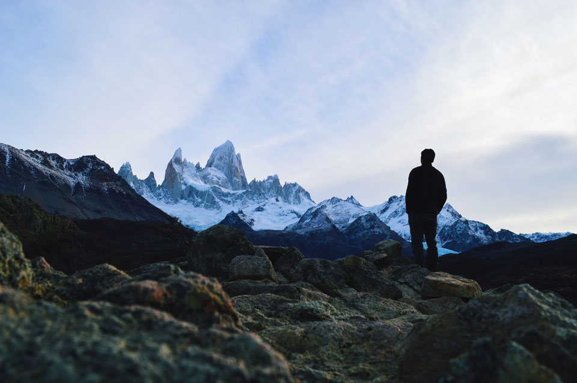

On April 27th, 2016, I bought a plane ticket to Argentina. I was set to spend 5 weeks on a study abroad program studying Argentina history, culture and literature, and 2 weeks with not sure what. Swelling with mixtures of excitement and anxiety, I repeatedly asked myself: "What's it going to be like?" I had never visited a foreign country other than Nepal (my birthplace) and USA (my current home).

The Argentine flag in Iguazú.

After a 26-hour flight delay in Texas, I luckily caught a flight as a standby passenger and arrived in Buenos Aires 10 hours later. On arrival, while waiting for my luggage, it slowly dawned upon me that there was something amiss. My baggage had been mishandled and was stuck in Texas along with a thousand others. My trip was already off to a bad start with the weather-induced flight delay, and the last thing I wanted was to lose my stuff. I walked up to the baggage claim and expressed my concern (in Spanish) and immediately realized that I did not understand a single word that was spoken back to me. The accent was so thick, and with words blended together seamlessly, it sounded like a cacaophony of unrecognizable Spanish words layered with a heavy Italian accent. There goes my confidence. I asked to speak to someone in English and they promptly filed my claim. I hung around the airport waiting for my 5-hour bus ride to Rosario (~200km away). During this time, I also got to experience my first meal in Argentina: McDonalds. And so began the long ride to Rosario.

Home for the next 5 weeks.

I arrived late at night in Rosario with my phone dead and an address of my host family's home. The bus driver let me know that we had arrived at my destination. I asked him to assist me in finding the exact door since it was my first time in the country and I'm a student with an assigned home. He happily got out and made sure that someone was home expecting me. We rang the doorbell and my host mother cheerily popped her head out the window with excitement. The bus driver wished me luck and went on his way. The door opened and there she was, a short, jolly, middle-age woman with a sweet, raspy voice. She embraced me at first sight and welcome me. We clicked right away. She showed me my room, gave me a tour of her lovely house, and served me some warm dinner (pastel del carne) with a refreshing glass of wine. We conversed about the whole fiasco I had just experienced. She could not speak English, so lucky for me, I was forced to speak in Spanish the whole time. She spoke slowly and with clarity, which helped me understand her much better and also helped me regain my previously lost confidence in my Spanish skills. I got extremely lucky with my host mom, she was everything I wanted. While I was bummed that I didn't have a perfect family to live with, I was gifted with the hospitality of the most affectionate and amiable host-mom I could asked for. We developed an incredibly strong bond, and every single night of dinner consisted of lively conversations spanning a variety of topics ranging from adversity, love, family, dreams, tragedy, politics, history, consciousness and spirituality amongst other things.

The view from the backyard.

Rosario is a beautiful city. It's rich in history and culture, and the nightlife is booming. Partying until 7am made me feel sick constantly.

Towards the end of my 5 week study abroad program, I started to think about where I would go for the next 2 weeks. Having seen Fitz Roy in rock climbing films, I started to think that exploring Patagonia is definitely possible. I couldn't find anyone else to go with, so I decided to go on my own. Was I nervous? Of course. Did I doubt myself? No doubt about it. But something inside of my felt that it was the right thing to do. I knew it would help me grow as a person if I traveled alone, and it would definitely take me out of my comfort zone.

The majestic Cerro Fitz Roy. Hover your mouse over it!

<figure>
	<blockquote>
		
It is a press, certainly, but a press from which shall flow in inexhaustible streams… Through it, god will spread his word.

		<footer>
			<cite>—Johannes Gutenberg</cite>
		</footer>
	</blockquote>
</figure>
