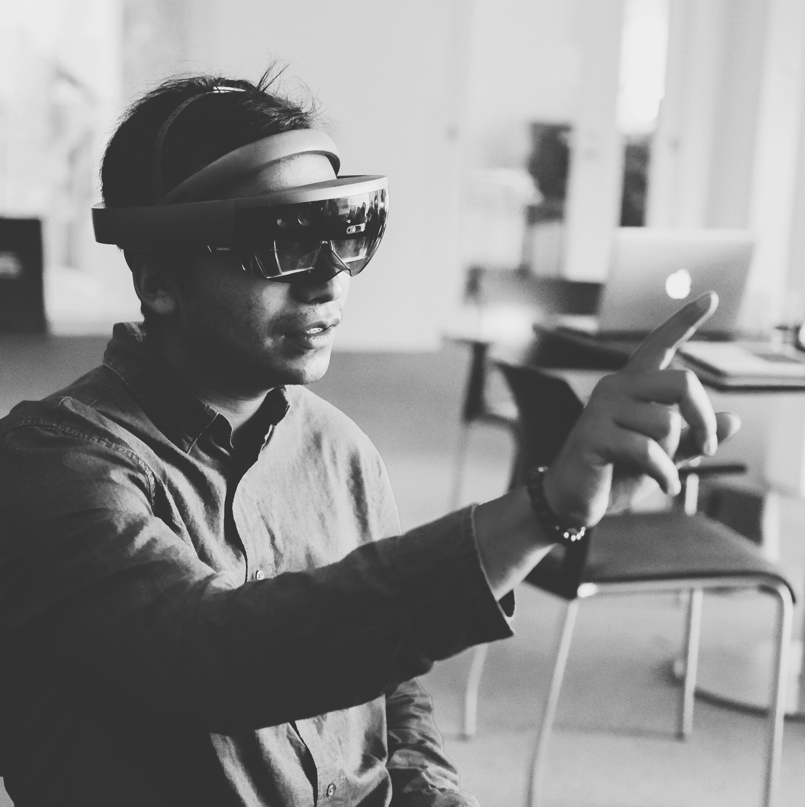

2017 turned out to be quite the year! After spending 5 years at the University of Colorado Boulder studying Computer Science and Digital Media, I'm happy to finally be done with school. What a trip that was! Academia was never my forte, and I always gravitated towards learning by doing instead of studying for exams or doing homework assignments. I guess I'll forever be a student regardless of whether I'm in school or not. There are so many fascinating things to learn about that there isn't nearly enough hours in the day to do it all. I definitely enjoy looking back to those all nighters working on programming assignments or putting off papers until the last day, either because I would rather procrastinate by playing music or going out with friends or doing other crazy things. I'm surprised I even survived all of that. Regardless, I'm grateful for the experience and all the personal and professional growth that came with it.

 

_My old bedroom-studio for most of my college career. Good memories here._

In the midst of trying to finish school without failing my final exams, I was desperately looking for a full time job. The whole thing was such a scramble. It took me precisely 43 job interviews, only 2 of which turned into legitimate offers. Now, I'm makin' stuff at [Viget](http://viget.com), a full-service interactive agency that specializes in custom web software and hardware. It's been such a trip working with a really talented group of people doing a variety of things these past 6 months, and I'm excited to see where my journey with Viget leads to. None of this would've been possible without the things I learned from my previous job at [Alpine Labs](http://alpinelaboratories.com), a hardware startup that built remote triggers for DSLR cameras. That's where I really got to see the marriage of hardware and software, and how powerful web technologies can be, especially JavaScript.

 

 

I've had the opportunity to make some really cool stuff at Viget. Tech wise, I'm heavily exploring JavaScript and React, two pieces of technology which have changed the way I look at software. It's seriously such an exciting time to be a web programmer. There's so many avenues to explore, but for me, it's always been about making art and using the browser or the smartphone as my canvas. I've been exploring a lot of WebGL, GLSL, WebVR, and Mobile AR on my free time as well. I think the ideal day for me would be to spend half of it programming graphics and the other half playing music. Maybe one day.

 

_Playing around with the Microsoft HoloLens at MIT during a hackathon._

Something really cool that I got to take part in this year was a VR/AR Hackathon at the MIT Media Lab. Our team ended up placing third for the Everyday Mobile AR Hack Award by Samsung for our project [Luminate](https://devpost.com/software/luminate). It was a really hectic but fun experience and I'm definitely looking forward to attending more hackathons in the future.

 

_One of the videos I did manage to make with my music buddy Sam Martin. Scope it [here](https://www.youtube.com/watch?v=DwvlEhy5q5Y)!_

Now that I have no academic commitments, it's been much easier to allocate time for music. The electro-acoustic stuff that [I used to upload on SoundCloud](http://soundcloud.com/effulgence) is still there, but I'm honestly more focused on honing my chops on the guitar before going back to the computer. I'd also like to focus on creating more videos instead of delivering just audio. I think there's a lot to be explored in the audiovisual realm, especially once realtime software components are brought into the equation. I've got a few ideas brewing for the moment, but nothing concrete yet. There's a million ways in how the software + music + visuals recipe could pan out, so more on that soon! As of right now, I have two new videos on YouTube, both made by my good friend Ben Crawford. One is about [why I do what I do](https://www.youtube.com/watch?v=UHDN-TyN92U), and the other, [a 60 second fingerstyle cover of The Scientist by Coldplay](https://www.youtube.com/watch?v=2PNG4Nei8CI).

_Just a nerd and his guitar in the middle of a forest in Flagstaff, Boulder._

Traveling is fun, and I got to see a little more of the States this year. Ever since my [study abroad trip to Argentina](http://prayash.io/blog/undiscovered-colors), I've had the itch to visit new, unfamiliar places. It's always really inspiring to travel and come back to things with a fresh and recalibrated perspective.

 

 

So, here's to hoping the trend will continue in 2018. Looking forward to more art, more music, more traveling, and more living in general. 👍
