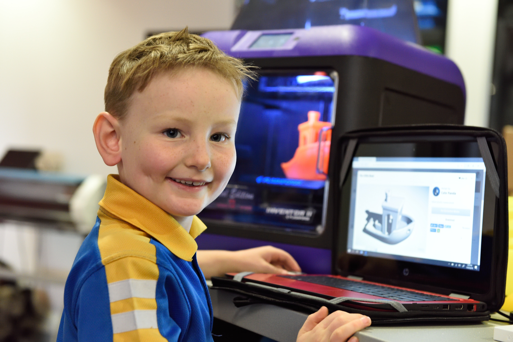
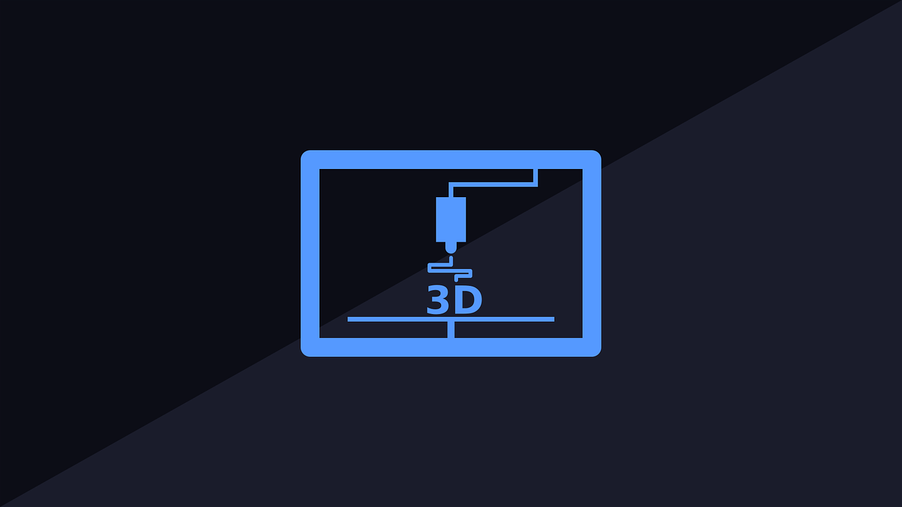
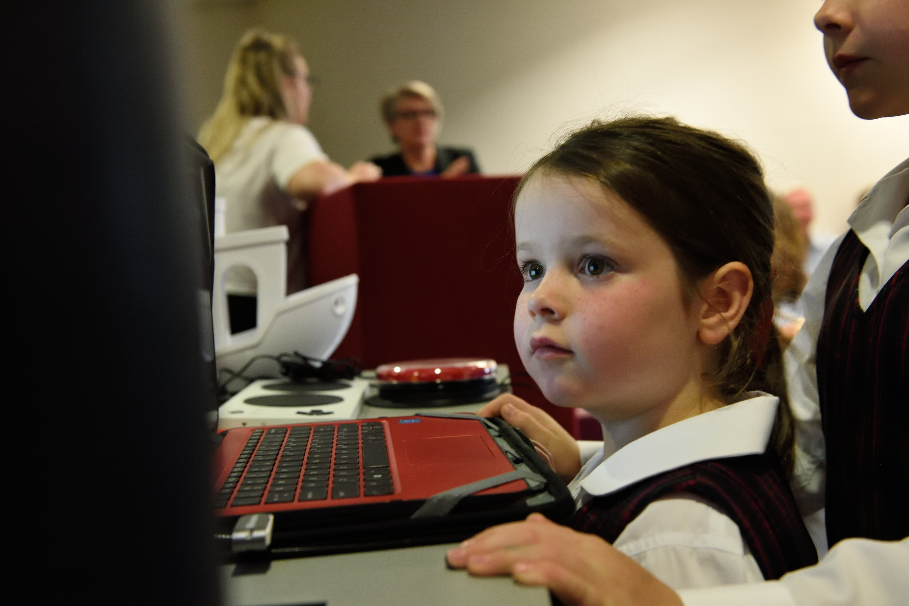
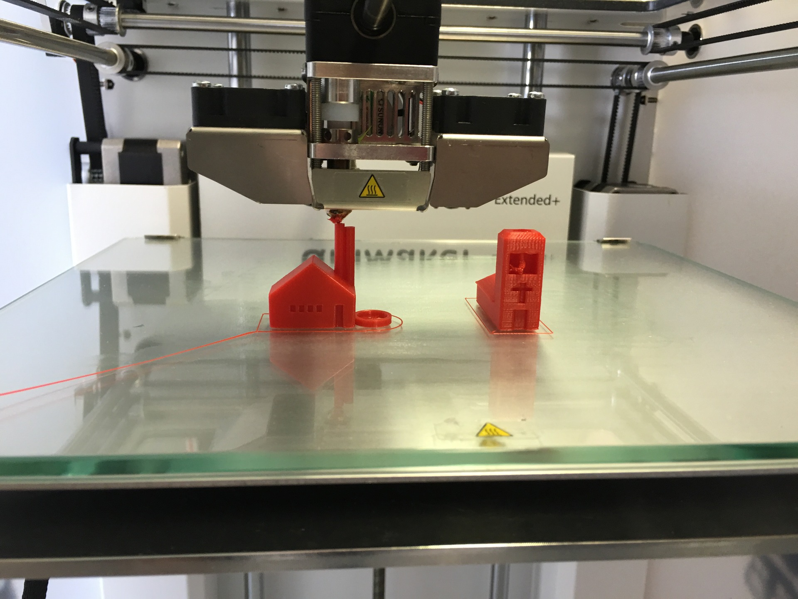

3D yazıcılar; öğrenim çağındaki, meraklı ve hayal gücü sınırsız çocuklarımız için fikirlerini sonuca dönüştürmeye yarayan bir araçtır. 3D yazıcılar okullara girdikten sonra öğrencilerin fiziksel, zihinsel, mesleki ve sosyal gelişimlerine katkı sağlamaktadır. Öğrenciler bir hücrenin yapısını 3D yazıcıyla basabilir, bir organı birebir kopyalayarak üretebilirler. Ayrıca, çocukların hayal dünyasına sınırlama getirmeden kendileri ne istiyorsa onu tasarlayıp üretmeleri mümkündür. 3D yazıcıların eğitime katkısı kısaca aşağıdaki sıralanabilir;

- 3 boyutlu görseller sayesinde, öğrenciler tarafından anlaşılması güç olan konuların anlatılması kolaylaşır.
- Derste anlatılacak konularla ilgili örneklerin küçük modelleri çıktı alınarak öğrencilerin derse olan ilgisi ve motivasyonu daha uzun süre korunur. Modellerin çıktılarının alınması konusunda 3D Baskı Hizmetimizden de faydalanabilirsiniz.
- Öğrencilerin proje tabanlı öğrenime geçmeleri sağlanır. Bununla birlikte, öğrencilerin kendi projelerini bilgisayar dışı bir ortamda yaparak bizzat ürüne dönüştürmeleri sağlanır.
- İnteraktif sınıf aktivitelerinin gerçekleştirilmesi sağlanır. Öğretmenlerin, öğrencileri ile paylaştığı bilgi sadece kitap sayfaları arasında kalmaz ve öğretmenler istedikleri örneği oluşturarak öğrencilerle paylaşabilir.

 

_Matbaa 4.0_

## Artan Hayal Gücü ve Yaratıcılık
Uluslararası Eğitim Teknolojileri Topluluğu'na göre 5 sene içerisinde 3D yazıcıların, nesnelerin interneti (Internet of Things) ve oyunlaştırma STEM kapsamında eğitim teknolojileri içinde yerini alacağı belirtilmiştir. Bu üç teknolojiyi bir arada barındıran proje olan ArtıBoyut Eğitim, müfredat hazırlama ve içerik konularında da okullara destek olmayı amaçlamaktadır.

Dünyanın konuştuğu ve üretim devriminin başındaki hareket olan Maker Hareketi kapsamında, 3D yazıcıların önemi ve yeri çok büyüktür. Motivasyonun eğitimde çok önemli bir yeri olduğuna inanan ArtıBoyut; matematik, fizik, kimya, biyoloji ve tarih gibi derslerin tümünü kapsayan bir müfredat içeriği üzerine çalışmalarını devam ettirmektedir. Tüm derslerin saha kullanım alanlarını kapsayan, tasarıma, mühendisliğe ve üretime dayalı bir eğitim sistemini ArtıBoyut 3D Yazıcılar ile sağlayabilirsiniz. Okul çağındaki öğrenciler sahaya atılmadan önce kendi tasarımlarını üretebilir, inovasyon ve üretimle okul çağında tanışabilirler. Ayrıca, öğrenciler kendi tasarımınlarını ellerine aldığı zaman yaşadığı motivasyon ve öğrenme isteği çok önemlidir. Karekod, bu motivasyonun eğitimdeki etkisinin çok büyük olacağına inanmaktadır.

 

 

Öğrencilerin fikirlerini 3D modellere dönüştürmesine olanak sağlayan tasarım programları hayal güçlerini geliştirmelerine de yardımcı olmaktadır. 3D yazıcılar sayesinde öğrenciler, tasarladıkları soyut objeleri somut hale kolayca dönüştürebilmektedirler. Böylece, tasarımlarını gerçek dünyada da karşılığını görmeleri ve dokunabilmeleri öğrenciler için benzersiz bir deneyim olmaktadır. Öğrenciler, tasarım yeteneği kazanmasıyla çevresinde gördüğü sorunları tespit edip bunlara tasarım programlarını kullanarak çözümler üretmeye başlarlar. Daha sonra 3D Yazıcıları kullanarak geliştirdikleri çözümleri somut hale dönüştürmeleri ise daha yaratıcı ve çözüm odaklı olmalarını sağlamaktadır. 3D yazıcıların sınıflarda kullanılması öğrenciler için gözünde canlandırılması zor olan objelerin daha kolay anlaşılmasını da sağlar. Böylece, müfredattaki dersler farklı duyu organlarına da hitap ederek daha akılda kalıcı ve öğretici olur.

Türkiye'nin 3 boyutlu yazıcı markası ArtıBoyut, tüketen değil üreten bir nesil yetiştirmek için geliştirdiği projeleri ve eğitimleri ile eğitim kurumlarında üç boyutlu yazıcı laboratuvarı kurma çalışmalarına başlamıştır. Bu eğitimler ve laboratuvarlar sayesinde çocuklar, henüz orta öğretimdeyken bile kendi tasarımlarını üretebileceklerdir. Tüyap Sign İstanbul 3DPrintShow fuarında üç boyutlu yazıcıların eğitim alanındaki önemi üzerine sunum yapan ArtıBoyut, Özel Nova Okulları ile başlayan “Robot Programlama ve 3 Boyutlu Yazıcı Uygulamaları” projesini Türkiye'nin birçok okulunda yaygınlaştırmayı hedeflemektedir.
