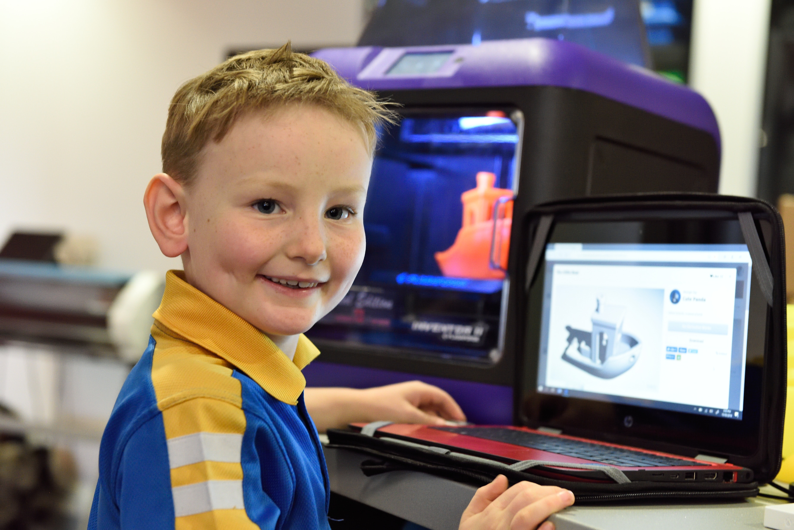
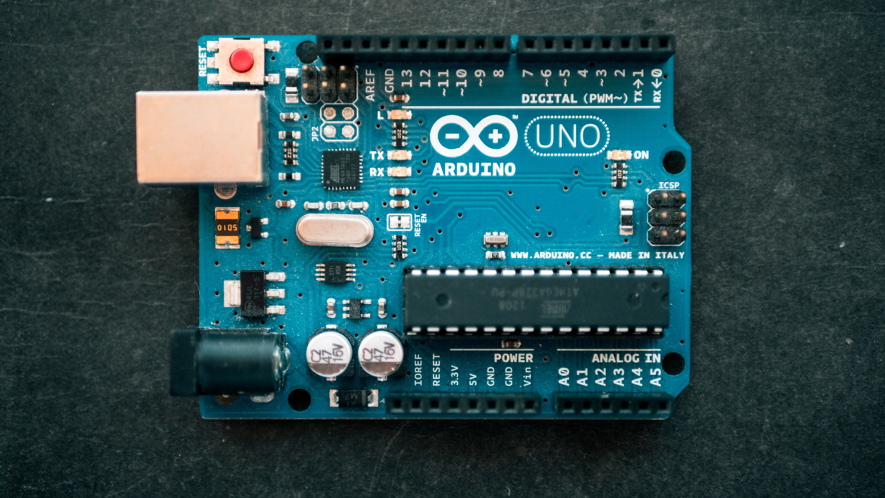

# Arduino

Çocuğunuzun kendi dijital saatini yapmasını istemez misiniz? Peki, tatildeyken balıklarına internetten yem vermesini, kendi robotunu, kardeşi ağladığında annesine haber veren sistemi? Arduino ile hayaller gerçek oluyor!

Arduino, son yılların en popüler elektronik kontrol sistemleri geliştirme kartlarından biridir. Kullanımının kolay olması ve açık kaynak kodlu olması sebebi ile çocuklarınıza oyun oynayarak algoritma ve programlama yeteneği kazandırır.

Çocuğunuz bu yeteneği hayal dünyası ile birleştirerek bize değişik platformlar sunar.
İleri düzey elektronik projeler geliştirilmesi için kurulan, farklı yaş gruplarına uygun hazırlanmış Arduino atölyemizde, uzman eğitimciler tarafından temel elektronik devreler, elektronik programlama, otomasyon sistemleri ve robotik uygulamalar gibi sınırsız sayıda proje geliştirilecektir.

Atölyemiz de çocuklarınızın geliştireceği projeler için her türlü donanım desteği sağlanmaktadır.