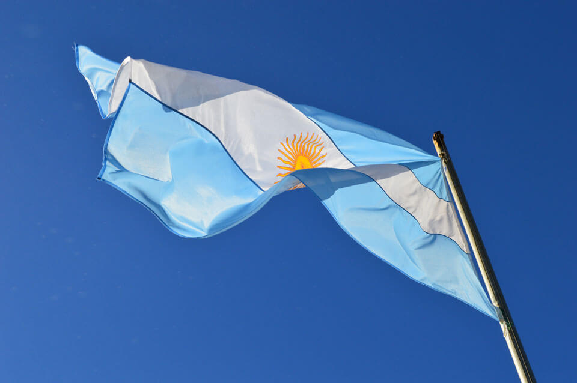
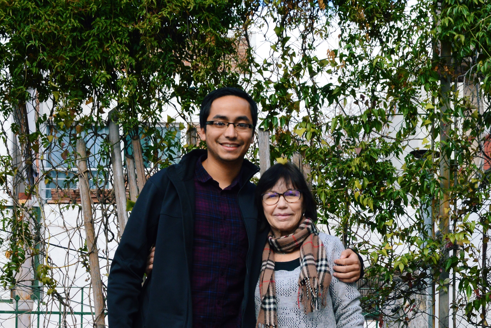
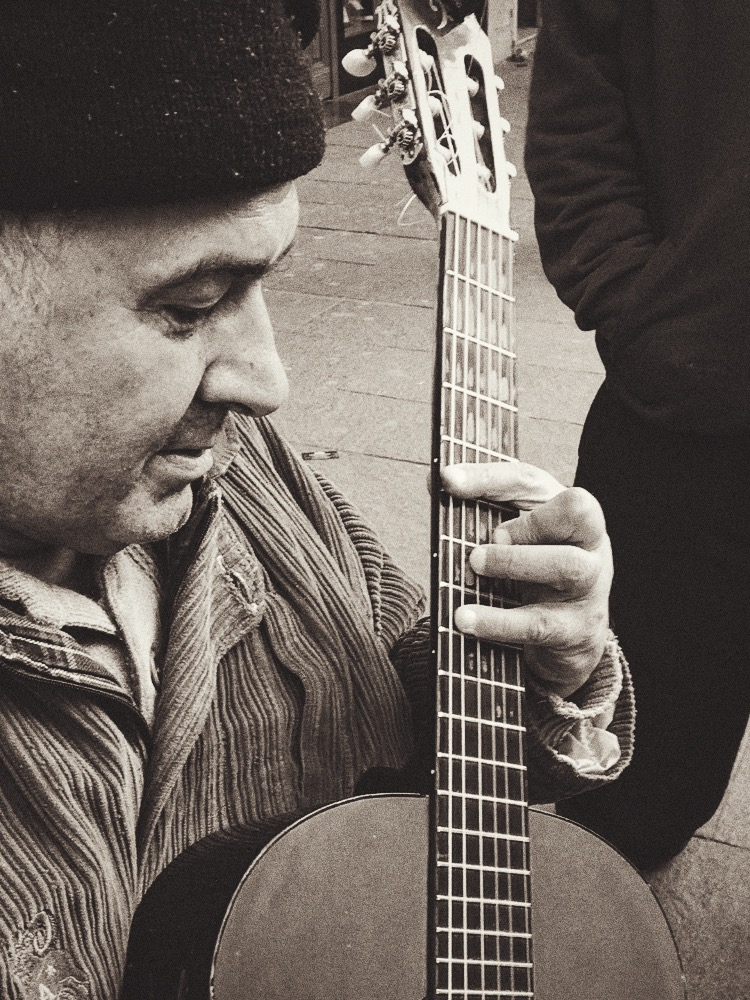
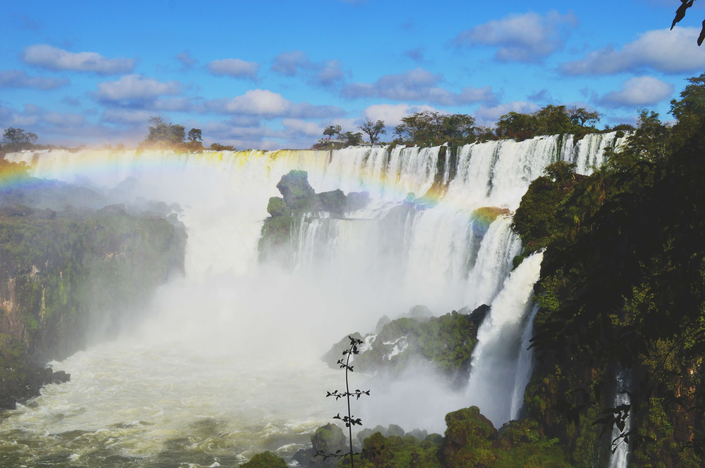
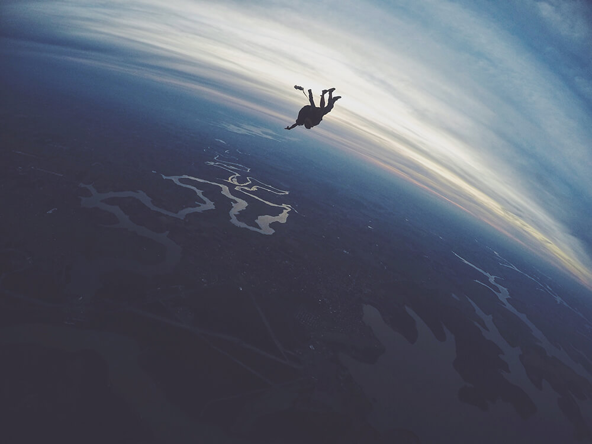
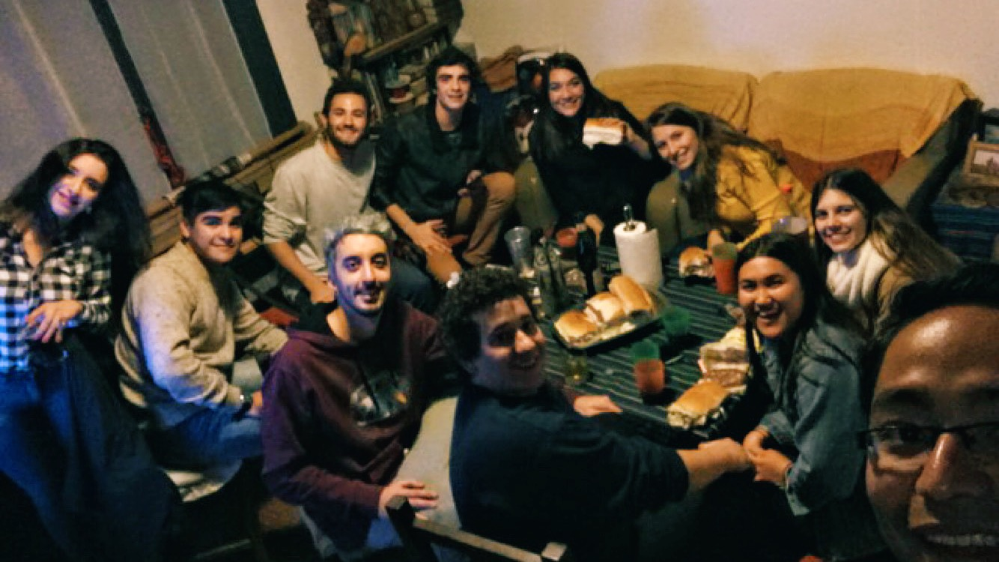
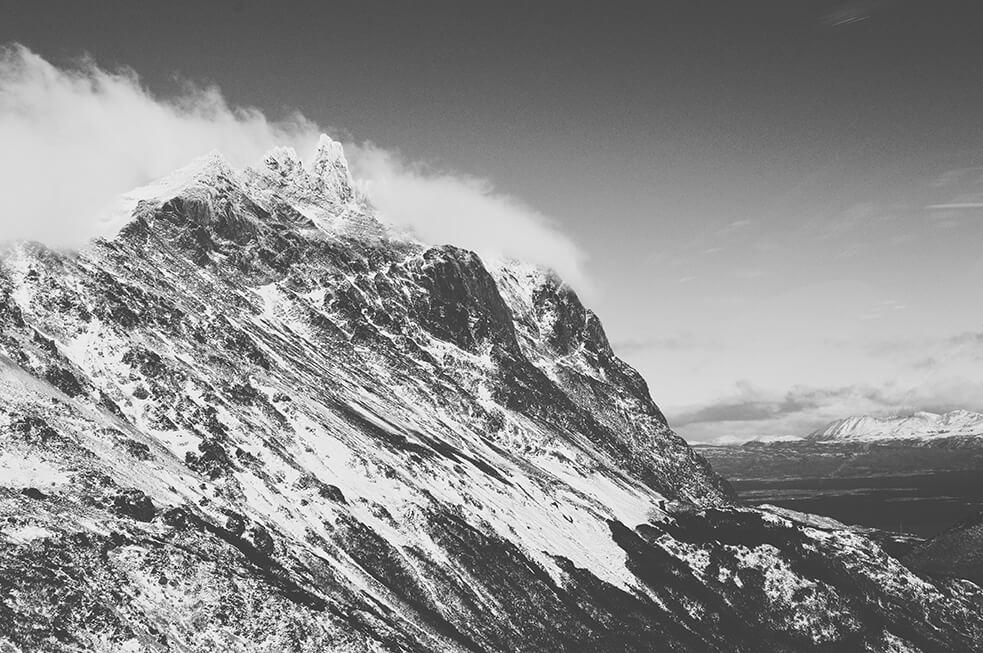
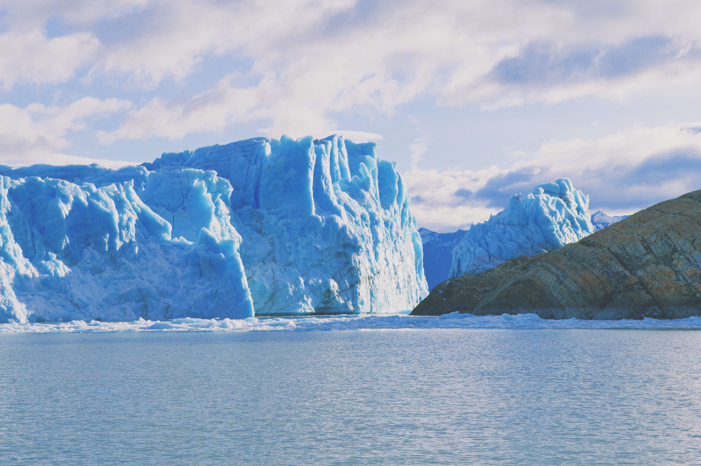
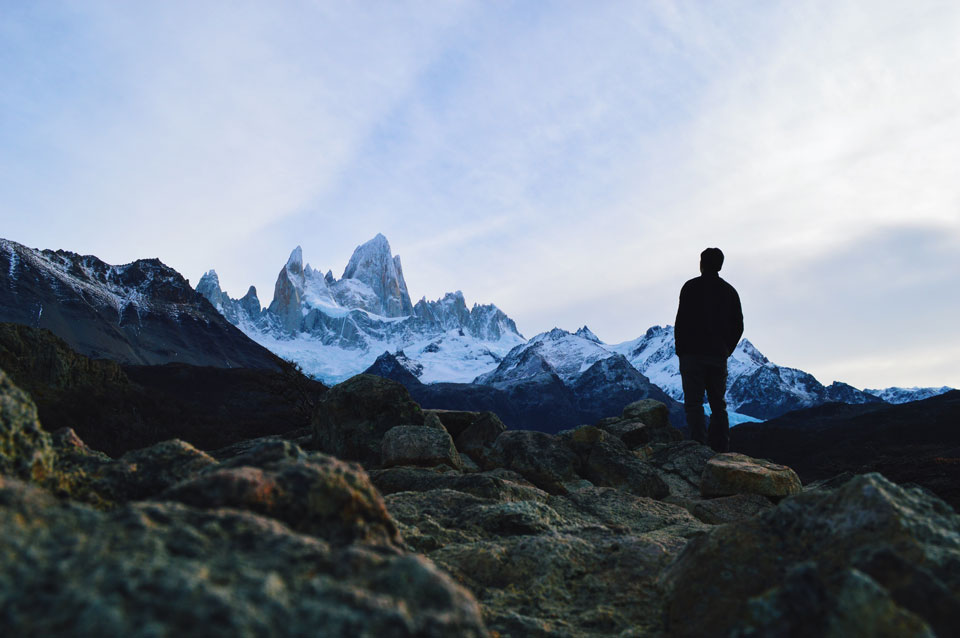

The summer preceding my last year of college, I decided to study abroad in a Spanish-speaking country. I had been formally studying the language since high school and my ultimate goal was to cap it all off with an immersive experience somewhere in Latin America. I had always heard great things about Argentina, but after being exposed to Argentine films and music, it kind of left a lasting impression on me. I enrolled in a program through my school and off I went to Rosario for two months to study Argentine literature, history and culture.

 

 

Aside from getting stuck at the airport for a full 24 hours and having my luggage mishandled and lost for a week (thanks United), I arrived in Rosario in one piece. My host-mom turned out to be the most affectionate host I could've ever asked for. Every single night we sat down together for dinner and engaged in lively conversations spanning a variety of topics ranging from love, family, dreams, tragedy, politics, history, consciousness and spirituality amongst other things. It also helped that she knew practically no English, so I was forced to speak Spanish the entire time. She became my professora-at-home, helping me convert rudimentary Spanish sentences to more elegant ones. We developed an incredibly strong bond, and to this day, I still keep in touch with her. I would definitely like to go back and visit her in a few years. I know I've got a home in Rosario now.

 

_The view from the patio. The constant chatter of children playing fútbol in the field below never stopped. It made for a wonderful ambience. The people are so serious about the sport that it's basically a religion. I'm not kidding – they even have a [church dedicated to Maradona](https://iglesiamaradoniana.wordpress.com/)._

 

_Me and my madre Argentina, cheesin' on the day of my departure. A bittersweet moment, but I know I'll be visiting her soon enough._

Rosario was a beautiful city to study in. It's rich in history and culture, and the nightlife is booming. I made some great friends and had a lot of fun exploring the city. My favorite activities were boating across the river, learning tango, going clubbing with friends, pigging out on amazing steaks, drinking yerba maté by the river, and generally exploring the lesser known nooks and crannies of the city.

_A street musician strumming some beautiful chords to an italian love song. Me being a guitar nerd, I noticed that he used some really unique chord voicings. He had an incredible touch of romance to his music._

On one of the weekends, some friends and I ventured out to southern Brazil for a weekend at Puerto Iguázu, named after the incredible waterfall Las Cataratas del Iguázu. I hope every person on this planet gets to visit this place at least once. The sheer scale of these cascades combined is mind boggling. Not to mention the loud roar you can hear from miles away. To percieve something of this scale in person made me feel insignificant. I guess that's the beauty of being a tiny human on a big planet.

_Yes, such a thing exists. This is only showing half of the [Iguazú Falls](http://whc.unesco.org/en/list/303). About 20% of it is on the Brazilian side. And if you get a chance to go here, do visit the last section of this waterfall called La Garganta del Diablo, or The Devil's Throat._

_Skydiving above The Triple Frontier (border of Argentina, Brazil, and Paraguay) was a such a visceral experience. So intense, but surprisingly tranquil at the same time... who knew it would be so quiet up there at 12,000 feet! Once the parachute deployed, it was virtually pin drop silent, which made for a very calming descent. The view was absolutely unreal and seeing the 3 bordering cities from the sky made the diversity of these places very obvious._

_We made some wonderful friends at the clubs in Rosario. They welcomed us to their home and even served us some classic asado. Here's the whole crew enjoying Fernet & Coke alongside ungodly servings of Choripan and Chimichurri. Thank you boludos!_

Aaaaaaand before I knew it, the program was over. It was time to say goodbye and come back home. But I was not satisfied. I think for me, the program was an excellent way of preparing myself for something bigger. I seriously had not had enough of this place. Argentina is a massive country and we hadn't even scratched the surface. I itched to explore more. After some research, I decided that doing a solo trip to southern Patagonia would be the best course of action. I felt that my Spanish had gotten to a point where I could thrive by myself. Without further ado, I booked a flight right away. It was time to cross a few items off my bucket list. After a few hours of the most turbulent flight I have ever experienced, I landed in Ushuaia, the southernmost city of the world. I had arrived very late at night during a hostile snowstorm so it was basically 0% visible. The next morning, I woke up to this:

_After a few hours of a bumpy 4x4 drive through some forests, I got on a cruise through the Beagle Channel._

 

_Riding a helicopter through the Andes right outside Ushuaia. There's something about the aesthetics of these mountains that makes it hard to forget._

 

_The pilot offered a glass of champagne at the top of the mountain where the helicopter had landed. The elevation made for a real nice buzz._

 

I would be remiss if I didn't mention the epic glaciers en route to El Chaltén, the trekking capital of Argentina. El Calafate is a small town in close proximity to some of the biggest glaciers on the Patagonian Ice Field.

 

_El Perito Moreno, a massive 240 ft tall glacier that intermittently ruptures from its own pressure due to its constant movement. The reverberation of the sound it makes when it's cracking is impressive to say the least!_

 

And at last...

_The majestic Cerro Fitz Roy. I could stare at this thing all day long. And I did._

Exploring all these new places by myself taught me countless things. One of the biggest things was learning to enjoy solitude. We're so accustomed to constantly being surrounded by people that we forget what it's like to enjoy our own company. I think developing that sense of peace with yourself and enjoying solitude is so important to living a happy life. Sure, I felt lonely as hell at times, but it was the perfect time for a lot of self reflection and re-evaluation. More importantly, being in a perpetual state of feeling nervous and outside of my comfort zone really helped me grow as a person. I never had a bubble to retreat to.

Perhaps the most important lesson I learned from this trip was to always be looking for undiscovered colors in my own life. Experiencing a totally foreign culture made me appreciate my own culture tenfold. It made me appreciate my own upbringing, my daily routine, my friends, family and loved ones. Towards the end, I actually missed the monotony of my own life. The things that once seemed mundane and ordinary all of a sudden seemed extraordinary when I distanced myself from it. After being exposed to vastly new and fresh experiences, I felt re-energized.

Traveling can have such profound effects on one's sense of self-confidence and satisfaction with the world. In the end, we're all humans and borders are artificial, man made constructs. We all operate under the same laws of human nature and intrinsically, the human connection is always there waiting to be felt regardless of skin color, religion, or nationalistic pride. I can't count the times when other people went out of their way to help a stranger like me, especially when traveling alone. It restored my faith in humanity and reinforced my belief that people are inherently good-hearted and want to help other fellow humans.

This was my first time venturing outside of the US (aside from Nepal), and it surely won't be my last. I couldn't help but feel a lingering sensation of emptiness inside me when I woke up the morning after I landed back in the US. It really felt like I left a part of myself in Argentina that I'll never get back. From all the wonderful people I met to the new experiences I had, I'm super grateful to have had the opportunity to do so. And making that solo trip happen in Patagonia witnessing its out-of-this-world beauty was the most liberating thing I could've done for myself. I'm already looking forward to returning to this beautiful, multi-faceted country.

Chau Argentina, siempre tendrás un pedazo de mi corazón. 🇦🇷
